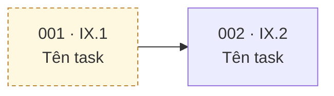

## Tổng quan (Overview)

<!--
EPIC này giải quyết vấn đề gì, và vì sao nó nằm trong sprint này?
Nếu nó ánh xạ từ mục tiêu sprint trong SDP, TRÍCH NGUYÊN VĂN câu đó.
-->

> **Use-case liên quan:**
> **Tài liệu gốc:**

---

## ⚠️ Ràng buộc bắt buộc

<!-- Những ràng buộc áp dụng cho MỌI sub-issue của EPIC này -->

| #   | Ràng buộc | Ý nghĩa cụ thể |
| --- | --------- | -------------- |
|     |           |                |

---

## Phạm vi (In scope / Out of scope)

<!--
Mục Out of scope quan trọng ngang In scope. Ghi rõ cái gì KHÔNG làm ở sprint này
và đẩy sang đâu - nếu không, sẽ có người tự ý mở rộng phạm vi giữa sprint.
-->

**In scope – Sprint N:**
-

**Out of scope – đẩy sang Sprint N+1:**
-

---

## Sub-issues

<!-- Dùng tính năng sub-issue của GitHub. GitHub tự render danh sách bên dưới. -->

---

## 🔗 Bản đồ phụ thuộc

<!--
Vẽ bằng mermaid - GitHub render trực tiếp trong issue.
Mọi mũi tên ở đây PHẢI đã được khai báo bằng GitHub issue dependencies
(sidebar "Relationships"), sơ đồ chỉ là bản nhìn cho dễ.

Lưu ý cú pháp: ĐỪNG viết ký tự # trong nhãn node (mermaid hiểu là entity code).
Viết "113 · I6.1" thay vì "#113 · I6.1".

Sau khi vẽ, nêu rõ 2 điều: ĐƯỜNG GĂNG của EPIC, và issue nào KHÔNG CHẶN AI
(vì đó là issue cắt được khi sprint quá tải).
-->

**Đường găng của EPIC:**

**Không chặn ai (cắt được):**

---

## Definition of Done cho EPIC

<!-- Bằng chứng chạy thật ở mức end-to-end, không phải "các sub-issue đã đóng" -->

- [ ]
