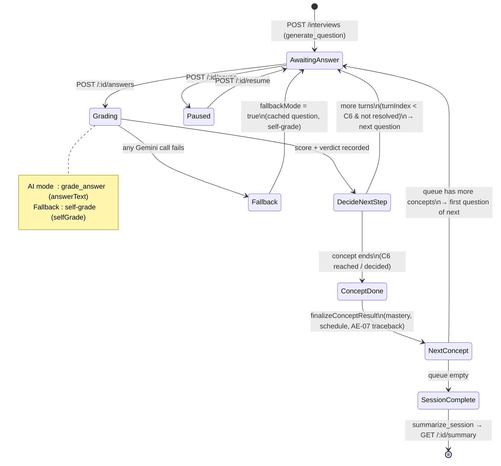

# AI Examiner — Architecture (Interview State Machine, C4 Boundary & Fallback)

> **SAD placement.** Content for **Section 4.x** of the Software Architecture Document
> (_Process View → AI Examiner_). Fulfils the Sprint-4 AI-Examiner architecture item of issue
> **#128 / I9.2** and feeds the full SAD assembly (**#84 / I5.1**). Scope: Sprint-4 behaviour of
> the multi-turn interview (EPIC #6) — this **adds** a section, it does not rewrite the SAD.
>
> **Source of truth:** the actual code under
> [`src/server/src/services/interview.service.ts`](../../src/server/src/services/interview.service.ts),
> [`concept-result.service.ts`](../../src/server/src/services/concept-result.service.ts) and
> [`gemini.service.ts`](../../src/server/src/services/gemini.service.ts). Nothing is invented.
>
> **Submission image:** [`uml/state-interview.puml`](uml/state-interview.puml), rendered via
> PlantUML (`java -jar plantuml.jar -tpng -Sdpi=200 uml/state-interview.puml`). The Mermaid
> diagram below is the GitHub-readable working copy for the team, not the submission artifact.

## 4.x.1 Overview

The AI Examiner runs a **multi-turn interview**: for each concept in the session queue it asks
up to **three turns** (constraint **C6**), grades each answer, and — when the concept ends —
computes a mastery score, schedules the next review, and traces back weak prerequisites
(AE-07/AE-08). The whole loop is a **deterministic state machine written in application code**;
the AI is called only at four fixed points and never decides _what happens next_.

The examiner has **two parallel state machines** selected by one flag, `session.fallbackMode`:

- **AI mode** — the normal path. `decideNextStep()` drives transitions; questions come from
  `generate_question`, grades from `grade_answer`.
- **Flashcard fallback (AE-05)** — entered the moment **any** Gemini call fails in the session.
  `resolveFallbackStep()` drives transitions over **pre-generated cached questions**, and the
  student **self-grades**. An AI outage must never kill a live session (#115).

## 4.x.2 Interview State Machine

The endpoint contract that exposes these transitions is specified in
[`docs/api/interviews.md`](../../docs/api/interviews.md) — in particular the four
`POST /:id/answers` outcomes (more-turns / concept-done / session-done / fallback), told apart by
the field combination `grading` × `conceptCompleted` × `nextQuestion` × `sessionCompleted`.

## 4.x.3 AI / Software Boundary (constraint C4)

**C4 — the AI is called at exactly four fixed points, each with a fixed JSON schema, and never
orchestrates.** Everything that decides _what happens next_ is deterministic application code and
carries **no AI colour**.

| AI call (Gemini)    | When                                        | Fixed output schema                                        |
| ------------------- | ------------------------------------------- | ---------------------------------------------------------- |
| `extract_concepts`  | Plan analysis (upstream, not per-interview) | concept list + prerequisites                               |
| `generate_question` | Start / next turn                           | `{ question_text, question_type }`                         |
| `grade_answer`      | Each answered turn (AI mode)                | `{ score, feedback, verdict }`                             |
| `summarize_session` | Session end                                 | `{ summary_text, strengths, weaknesses, recommendations }` |

Deterministic logic that is **explicitly not AI** (unit-testable with `DATABASE_URL` +
`GEMINI_API_KEY` stripped — risk **R05**):

- **`decideNextStep()` / `resolveFallbackStep()`** — the state machine above. The AI grades one
  answer; it does not choose whether to ask again, move on, or end.
- **`finalizeConceptResult()`** — weighted mastery score (`[0.2, 0.3, 0.5]`, renormalised for
  fewer turns), spaced-repetition scheduling.
- **AE-07 traceback** — BFS over the prerequisite DAG with a pruning rule (a mastered prerequisite
  is not traversed further); banded priority so ordering holds on the number alone.
- **`summarize_session` is fed already-computed scores** — it may not invent or alter
  `mastery_score`. `mastery_score` and `lastTestedAt` are written **only** by the AI Examiner
  grading flow (I7.2), never by any other module (e.g. Focus Session updates study statistics
  only).

## 4.x.4 Fallback Flow (AE-05)

Recall AI treats the AI as an **untrusted, failure-prone dependency**. The first failed Gemini
call in a session flips `session.fallbackMode = true` and the examiner switches state machine
without ending the session. The `fallback.reason` returned to the client says what it is falling
back _from_:

| `fallback.reason`      | Trigger                                                     | Behaviour                                                  |
| ---------------------- | ----------------------------------------------------------- | ---------------------------------------------------------- |
| `grading_unavailable`  | `grade_answer` failed                                       | keep the turn, no score; client shows flashcard self-grade |
| `question_unavailable` | `generate_question` failed                                  | serve a **cached** question for the concept                |
| `no_cached_questions`  | fallback needs a cached question and none exists (UC-12 E1) | close the session `completed` gracefully                   |

In fallback the student **self-grades** (`{ selfGrade: correct | partial | wrong }`), there is no
AI `feedback`, and questions are marked `source = "cache_fallback"`. Cached questions are
pre-generated per plan; invalidated when the plan's material changes or is re-analysed (#216) so a
stale question from replaced material is never served (constraint **C5**).

## 4.x.5 Traceability

| Element                                            | Requirement / Constraint      | Code                                                               |
| -------------------------------------------------- | ----------------------------- | ------------------------------------------------------------------ |
| Two state machines, one `fallbackMode` flag        | AE-05, #115                   | `interview.service.ts` `decideNextStep` / `resolveFallbackStep`    |
| ≤ 3 turns per concept                              | C6                            | `submitAnswer()`                                                   |
| Four fixed AI calls, no orchestration              | C4                            | `gemini.service.ts`                                                |
| Mastery / scheduling / traceback are deterministic | C4, R05                       | `concept-result.service.ts`, `utils/mastery.ts`, traceback service |
| `mastery_score` written only by AI Examiner        | Focus↔mastery boundary (#128) | `concept-result.service.ts`                                        |
| Cached-question invalidation on material change    | C5                            | `question-cache.service.ts` (#216)                                 |
