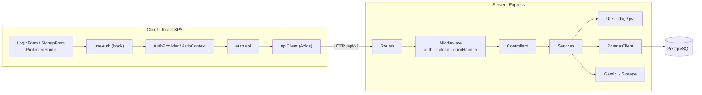
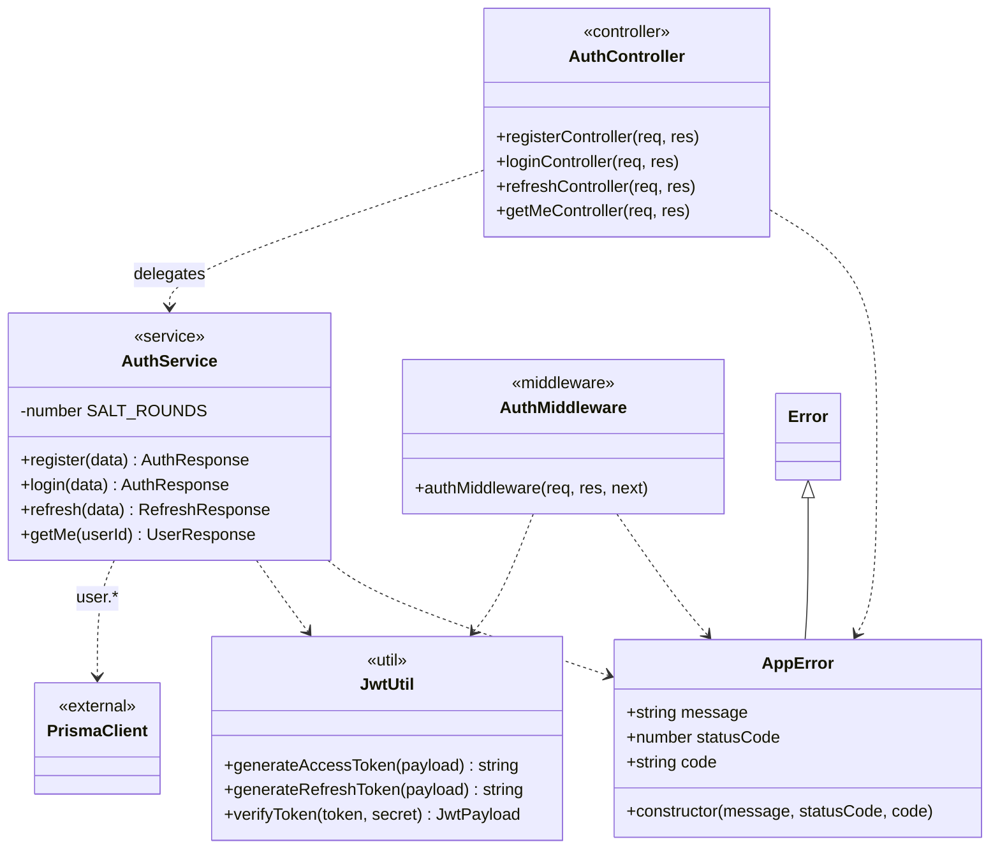
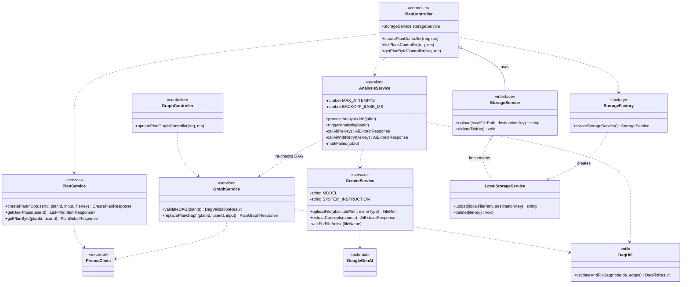
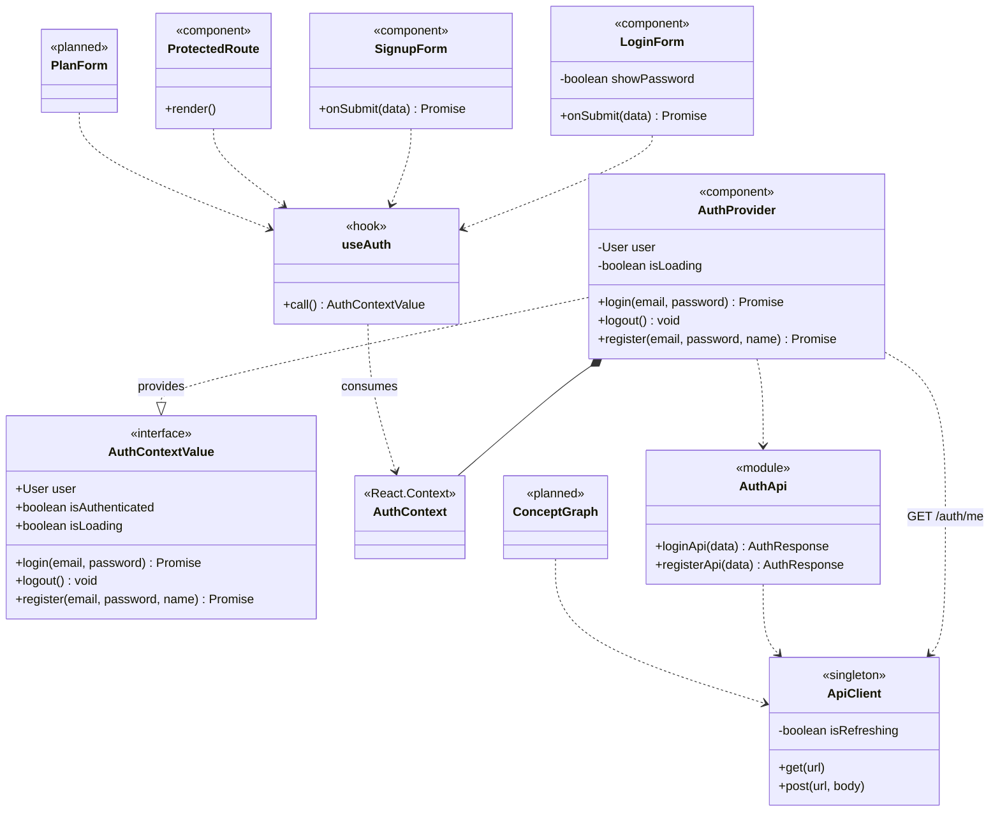

# Class Design — Recall AI

> **SAD placement.** Content for **Section 4.x** of the Software Architecture Document
> (_Logical View → Class Diagrams_). Fulfils issue **#85 / I5.2** and feeds the full SAD
> assembly (**#84 / I5.1**).
>
> **Source of truth:** the actual code under [`src/server/src`](../../src/server/src) and
> [`src/client/src`](../../src/client/src). Attributes and operations were extracted from the
> real files — nothing is invented.
>
> **Submission images (the actual PA3 deliverables):** three focused diagrams in
> [`pa/pa3/Class Diagrams/`](../../pa/pa3/Class%20Diagrams/) — one per logical component, the
> same way `pa/pa2/Use-case model/*.png` are per-use-case images rather than one giant chart.
> Rendered via PlantUML (`java -jar plantuml.jar -tpng -Sdpi=200 <file>.puml`) from the sources
> below. The Mermaid diagrams in this file are the GitHub-readable working copy for the team, not
> the submission artifact.
>
> | Component                  | PlantUML source                                                | Submission image                                                                                     |
> | -------------------------- | -------------------------------------------------------------- | ---------------------------------------------------------------------------------------------------- |
> | Authentication             | [`uml/class-auth.puml`](uml/class-auth.puml)                   | [`CD-01_Authentication.png`](../../pa/pa3/Class%20Diagrams/CD-01_Authentication.png)                 |
> | Study-Plan & Concept-Graph | [`uml/class-plan-graph.puml`](uml/class-plan-graph.puml)       | [`CD-02_StudyPlan_ConceptGraph.png`](../../pa/pa3/Class%20Diagrams/CD-02_StudyPlan_ConceptGraph.png) |
> | Front-end Auth feature     | [`uml/class-frontend-auth.puml`](uml/class-frontend-auth.puml) | [`CD-03_Frontend_Auth.png`](../../pa/pa3/Class%20Diagrams/CD-03_Frontend_Auth.png)                   |

## 4.x.1 Overview & Modelling Note

The back end is an **Express + Prisma (TypeScript)** application in a strict **layered
architecture**; the front end is a **React + TypeScript** SPA organised by feature.

**Modelling note (important).** Most back-end "classes" named in #85 (`AuthService`,
`PlanService`, `GraphService`, …) are implemented as **functional modules** — files that export
stand-alone functions, not `class` instances. This is a deliberate design choice (stateless,
tree-shakeable, trivially unit-testable). They are modelled below as UML classes with the
`«module»`/`«service»` stereotype and static (utility-class) operations. The genuine
`class`/`interface` constructs in the codebase are: `AppError`, `StorageService` /
`LocalStorageService`, and the React `AuthProvider` component — these are shown with their real
OOP relationships (inheritance, realization).

## 4.x.2 Authentication Component (back end)

| Class            | Kind      | Key members                                                                                    | Responsibility                                                                                     |
| ---------------- | --------- | ---------------------------------------------------------------------------------------------- | -------------------------------------------------------------------------------------------------- |
| `AuthController` | module    | `registerController`, `loginController`, `refreshController`, `getMeController`                | Thin HTTP adapters: parse/validate request → call `AuthService` → shape `{success, data}` response |
| `AuthService`    | module    | `register`, `login`, `refresh`, `getMe`; const `SALT_ROUNDS = 10`                              | Business logic: bcrypt hashing, duplicate-email check, token issuance, user lookup                 |
| `AuthMiddleware` | module    | `authMiddleware(req,res,next)`                                                                 | Guard: extracts Bearer token, verifies it, attaches `req.userId` / `req.user`                      |
| `JwtUtil`        | util      | `generateAccessToken`, `generateRefreshToken`, `verifyToken`; iface `JwtPayload{userId,email}` | Signs/verifies JWTs (access 15m, refresh 7d)                                                       |
| `AppError`       | **class** | `message`, `statusCode`, `code?`                                                               | Typed error carrying an HTTP status; `extends Error`, consumed by the central `errorHandler`       |

## 4.x.3 Study-Plan & Concept-Graph Component (back end)

| Class                 | Kind          | Key members                                                                                                           | Responsibility                                                                                                            |
| --------------------- | ------------- | --------------------------------------------------------------------------------------------------------------------- | ------------------------------------------------------------------------------------------------------------------------- |
| `PlanController`      | module        | holds a `storageService` singleton; `createPlanController`, `listPlansController`, `getPlanByIdController`            | Orchestrates plan creation: validate → store file → persist → fire background analysis; cleans up orphaned files on error |
| `PlanService`         | module        | `createPlanInDb` (plan + job in one `transaction`), `getUserPlans`, `getPlanById` (ownership check)                   | Persistence + ownership rules for study plans                                                                             |
| `GraphController`     | module        | `updatePlanGraphController`                                                                                           | HTTP adapter for the live graph editor (`PUT …/graph`)                                                                    |
| `GraphService`        | module        | `validateDAG` (repair policy), `replacePlanGraph` (reject-on-cycle); iface `DagValidationResult`                      | Graph persistence + two cycle policies: auto-fix for AI output, reject for user edits                                     |
| `AnalysisService`     | module        | `processAnalysisJob`, `triggerAnalysis`; private `callAi`, `callAiWithRetry` (3 attempts, exp. backoff), `markFailed` | Deterministic orchestration of one analysis job (constraint **C4** — AI only extracts)                                    |
| `GeminiService`       | module        | `uploadFile`, `extractConcepts`; private `waitForFileActive`                                                          | Only place that calls the Gemini API; returns schema-validated JSON                                                       |
| `DagUtil`             | util          | `validateAndFixDag` (Kahn's algorithm); ifaces `GraphEdge`, `DagFixResult`                                            | Pure function: strips self-loops/dangling edges, breaks cycles → always a DAG                                             |
| `StorageService`      | **interface** | `upload`, `delete`                                                                                                    | Storage abstraction                                                                                                       |
| `LocalStorageService` | **class**     | `upload`, `delete`                                                                                                    | MVP filesystem implementation (`implements StorageService`)                                                               |
| `StorageFactory`      | factory fn    | `createStorageService()`                                                                                              | Returns the right `StorageService` by environment (R2 planned for Sprint 4)                                               |

## 4.x.4 Front-end — Auth Feature

| Class                      | Kind             | Key members                                                                                        | Responsibility                                                              |
| -------------------------- | ---------------- | -------------------------------------------------------------------------------------------------- | --------------------------------------------------------------------------- |
| `AuthProvider`             | React component  | state `user`, `isLoading`; `login`, `logout`, `register`; verifies token on mount                  | Owns auth state; provides `AuthContextValue` to the tree                    |
| `AuthContext`              | React Context    | —                                                                                                  | Carries `AuthContextValue \| null`                                          |
| `useAuth`                  | hook             | returns `AuthContextValue`                                                                         | Typed accessor; throws if used outside `AuthProvider`                       |
| `AuthApi`                  | module           | `loginApi`, `registerApi`; type `User`                                                             | Wraps the auth REST calls                                                   |
| `ApiClient`                | Axios singleton  | request interceptor (attach Bearer), response interceptor (refresh-on-401 + retry); `isRefreshing` | Single HTTP client for the whole app                                        |
| `LoginForm` / `SignupForm` | React components | `react-hook-form` + `zodResolver`; `onSubmit` calls `useAuth().login/register`                     | The **real, implemented** auth forms                                        |
| `ProtectedRoute`           | React component  | `render()`                                                                                         | Route guard: spinner while loading, redirect to `/login` if unauthenticated |

> **Planned, not yet implemented** (shown with the `«planned»` stereotype): `ConceptGraph` and
> `PlanForm` are named in #85 but do **not** exist in the code yet — `CreatePlanPage.tsx` and the
> dashboard pages are literal `Placeholder`s (see `DESIGN.md`). Per the brief ("go as far as you
> know; do not imagine unrealistic members"), they are drawn as empty stubs and will be detailed
> once the Study-Planner and Concept-Graph UI is built. The implemented `LoginForm`/`SignupForm`
> stand in as the concrete example of the form pattern `PlanForm` will follow.

## 4.x.5 Design Patterns in Use

| Pattern                                                 | Where                                     | Evidence                                                                                                                                            |
| ------------------------------------------------------- | ----------------------------------------- | --------------------------------------------------------------------------------------------------------------------------------------------------- |
| **Layered architecture**                                | back end                                  | Route → Middleware → Controller → Service → Data/External; no layer skips downward                                                                  |
| **Dependency injection (module-level)**                 | controllers ← services                    | Controllers `import` service functions; services `import` `prisma`/utils — dependencies are wired at module boundaries, not hard-coded inside logic |
| **Strategy + Factory**                                  | `StorageService`                          | Interface + `LocalStorageService`; `createStorageService()` selects the impl by env (R2 stub commented for Sprint 4)                                |
| **Custom error hierarchy + centralized handler**        | `AppError extends Error` + `errorHandler` | One place maps `AppError`/`ZodError`/`MulterError` → HTTP responses                                                                                 |
| **Retry with exponential backoff**                      | `AnalysisService.callAiWithRetry`         | 3 attempts, `BACKOFF_BASE_MS · 2^(n-1)`                                                                                                             |
| **Pure-function domain core**                           | `DagUtil.validateAndFixDag`               | No I/O, no AI — Kahn's algorithm, unit-testable (constraint C4, risk R05)                                                                           |
| **Provider + custom hook (Context)**                    | front end                                 | `AuthProvider` + `AuthContext` + `useAuth()`                                                                                                        |
| **HTTP-client interceptor (transparent token refresh)** | `apiClient`                               | Response interceptor refreshes on 401 and replays the original request                                                                              |
| **Route guard**                                         | `ProtectedRoute`                          | Declarative auth gate via React Router `<Outlet/>`                                                                                                  |

## 4.x.6 Traceability

- Back-end classes map 1:1 to files under `src/server/src/{controllers,services,middleware,utils}`.
- Front-end classes map to `src/client/src/features/auth/**`, `components/shared/**`, `lib/**`.
- The persistent entities these services operate on (User, StudyPlan, Concept, …) are specified
  in the companion **[Database Design](database-design.md)** (SAD DB component, #86).
