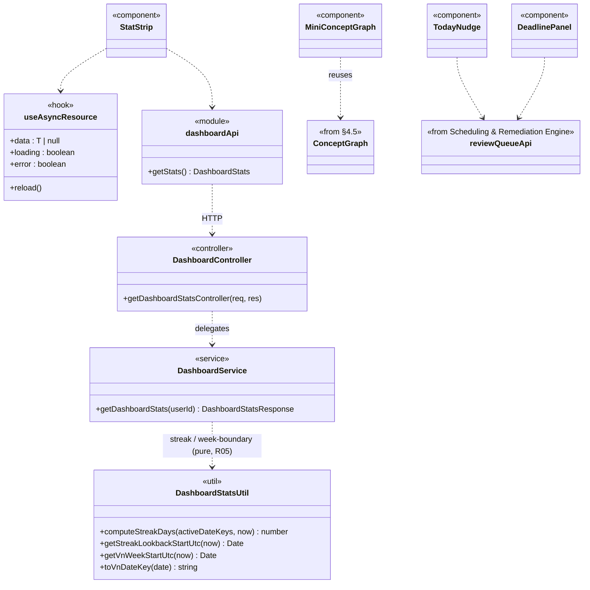

# Dashboard & Visualization — Architecture (Component: Dashboard)

> **SAD placement.** Content for **Section 4.9** of the Software Architecture Document
> (_Logical View → Component: Dashboard & Visualization_). Closes the PA3-feedback gap that only
> 3 of the 5 use-case modules (AM, SP, and AE — but not FS or DB) had a dedicated §4 subsection;
> this PR adds both missing ones (DB here, FS in `focus-session-architecture.md`).
> Fulfils issue **#111** (PA4 mục a) and feeds the full SAD assembly (**#84 / I5.1**).
>
> **Source of truth:** the actual code under
> [`src/server/src/services/dashboard.service.ts`](../../src/server/src/services/dashboard.service.ts),
> [`utils/dashboard-stats.ts`](../../src/server/src/utils/dashboard-stats.ts), and
> `src/client/src/features/dashboard/**`. Nothing is invented.
>
> **Submission image:** [`uml/class-dashboard.puml`](uml/class-dashboard.puml), rendered via
> PlantUML (`java -jar plantuml.jar -tpng -Sdpi=200 uml/class-dashboard.puml`) →
> [`pa/pa4/Class Diagrams/CD-05_Dashboard.png`](../../pa/pa4/Class%20Diagrams/CD-05_Dashboard.png).
> The Mermaid diagram below is the GitHub-readable working copy, not the submission artifact.

## 4.9.1 Overview

Dashboard & Visualization (DB-01…DB-09) is architecturally **thin on the back end and an
aggregation layer on the front end** — it is not a monolithic service that owns its own data.
The server side is a single read-only endpoint, `GET /dashboard/stats` (DB-01's stat strip: study
streak, weekly minutes, concepts mastered). Every other DB use case **composes calls already
documented in other §4 components** instead of duplicating logic:

- **DB-02** (Concept Graph mini-view) reuses the `ConceptGraph` React component and `planApi`
  from **§4.5 Study-Plan & Concept-Graph** directly (`MiniConceptGraph.tsx` imports them as-is).
- **DB-04 / DB-09** (Agentic Reminder, Dismiss/Snooze) call `reviewQueueApi`, which talks to the
  **Scheduling & Remediation Engine**'s `review-queue` endpoints (`scheduling.service.ts`).
- **DB-03 / DB-08** (Interview / Focus Session history) read the same list endpoints already
  covered under **§4.7 AI Examiner** and **§4.8 Focus Session**.

This is a deliberate architectural choice, not a gap: it keeps each metric's source of truth in
exactly one service (Dashboard never recomputes `mastery_score` or review priority itself), and
each panel fails independently (`useAsyncResource` per panel — one failed fetch never blanks the
whole page, per #169).

## 4.9.2 Class Diagram

| Class                          | Kind       | Key members                                                                     | Responsibility                                                                                                      |
| ------------------------------ | ---------- | ------------------------------------------------------------------------------- | ------------------------------------------------------------------------------------------------------------------- |
| `DashboardController`          | module     | `getDashboardStatsController`                                                   | Thin HTTP adapter — no query params to validate                                                                     |
| `DashboardService`             | module     | `getDashboardStats(userId)`                                                     | Read-only aggregation: streak days, weekly study minutes, concepts-mastered count over **active** plans only        |
| `DashboardStatsUtil`           | util       | `computeStreakDays`, `getVnWeekStartUtc`, `toVnDateKey` (pure, no Prisma/clock) | Timezone-correct (`Asia/Ho_Chi_Minh`) day/week boundaries; the **one** home for "VN today" shared with DB-09 snooze |
| `useAsyncResource`             | hook       | `data`, `loading`, `error`, `reload()`                                          | Generic per-panel data loader — each Dashboard block owns its own loading/error state independently (#169)          |
| `dashboardApi`                 | module     | `getStats()`                                                                    | Wraps `GET /dashboard/stats`                                                                                        |
| `MiniConceptGraph`             | component  | reuses `ConceptGraph` (§4.5) + `planApi` (§4.5)                                 | DB-02: embeds the real concept-graph visualization, not a re-implementation                                         |
| `TodayNudge` / `DeadlinePanel` | components | call `reviewQueueApi` (Scheduling & Remediation Engine)                         | DB-04 today's reminder / DB-09 dismiss-snooze — Dashboard is the UI, SRE owns the priority logic                    |

## 4.9.3 Design Notes

- **No duplicated business logic.** Every non-trivial computation Dashboard displays (mastery
  banding, review priority, DAG state) is owned by the component that already computes it
  elsewhere in §4; Dashboard only fetches and renders.
- **Independent panel failure.** `useAsyncResource` is called once per data source
  (`/dashboard/stats`, `/plans`, `/review-queue/today`) rather than one combined fetch, so a
  single failing endpoint shows one `BlockError` instead of a full-page error (#169).
- **VN-timezone boundary reused by DB-09.** `toVnDateKey`/`getVnWeekStartUtc` in
  `dashboard-stats.ts` are the single source for "what day is it in Vietnam" — DB-09's "Hoãn đến
  mai" (snooze to tomorrow) in the Scheduling & Remediation Engine must resolve to the exact same
  day boundary the streak counter uses, so that logic was deliberately kept in one file instead
  of duplicated into a new `vn-date.ts`.

## 4.9.4 Traceability

| Element                                       | Requirement         | Code                                                        |
| --------------------------------------------- | ------------------- | ----------------------------------------------------------- |
| Stat strip (streak, weekly minutes, mastered) | DB-01 · #230        | `dashboard.service.ts`, `dashboard-stats.ts`                |
| Concept graph mini-view                       | DB-02               | `MiniConceptGraph.tsx` (reuses §4.5 `ConceptGraph`)         |
| Agentic reminder / dismiss-snooze             | DB-04, DB-09 · #233 | `TodayNudge.tsx`, `reviewQueueApi`, `scheduling.service.ts` |
| Independent per-panel loading/error           | #169                | `useAsyncResource.ts`                                       |
