# Database Design — Recall AI

> **SAD placement.** This is the content for the **Database** component of the Software
> Architecture Document (§4 _Logical View_ → _Component: Database_). It fulfils issue
> **#86 / I5.3**, redrawn for **PA4 (#111)** to the current 13-table schema, and feeds the full
> SAD assembly (**#84 / I5.1**).
>
> **Authoritative source:** [`src/server/prisma/schema.prisma`](../../src/server/prisma/schema.prisma),
> as of `main` (includes the Sprint-5 `session_notes` table and the `documents`/`concept_sources`
> source-anchor tables).
>
> **Submission image (the PA4 deliverable):**
> [`pa/pa4/ER Model/ER-01_DatabaseModel.png`](../../pa/pa4/ER%20Model/ER-01_DatabaseModel.png) —
> crow's-foot ER diagram, rendered from [`uml/er-model.puml`](uml/er-model.puml) via PlantUML
> (`java -jar plantuml.jar -tpng -Sdpi=200 er-model.puml`). This is the image to drop into the
> Word SAD, the same way `pa/pa2/Use-case model/*.png` are used for the use-case diagrams — the
> Mermaid diagram below is the GitHub-readable working copy for the team, not the submission
> artifact. An alternative source, [`db/recall-ai.dbml`](db/recall-ai.dbml) (paste into
> [dbdiagram.io](https://dbdiagram.io)), is kept as a backup/editable format. The PA3 image
> (`pa/pa3/ER Model/ER-01_DatabaseModel.png`, 10 tables) is left untouched as the historical PA3
> record.

## 1. Overview & Conventions

Recall AI persists all state in a single **PostgreSQL** database accessed through the **Prisma
ORM**. The physical model below is generated 1:1 from the Prisma schema.

> **Scope cut-off.** This model reflects the **#111 (PA4)** deliverable scope — the 13 tables
> listed below. It does **not** include tables added for Sprint 5 / Interview v2, which was still
> in development at the time of this revision: `concept_checkpoints` (#329) and the upcoming
> `InterviewEvidence` (#330 / PR #338). Those land in a later SAD revision, not this one.

| Convention            | Rule                                                                                                                         |
| --------------------- | ---------------------------------------------------------------------------------------------------------------------------- |
| Primary keys          | `uuid` (`@db.Uuid`), application-generated (`uuid()`)                                                                        |
| Table names           | `snake_case`, plural (`users`, `study_plans`, …)                                                                             |
| Column names          | `snake_case` (`created_at`, `mastery_score`, …)                                                                              |
| Timestamps            | `created_at` / `updated_at` on mutable entities                                                                              |
| Referential integrity | Every foreign key is `ON DELETE CASCADE` (see §5)                                                                            |
| Value ranges          | `difficulty` (1–5), `mastery_score`/`score` (0.0–1.0) are **enforced at the application layer (Zod)**, not by DB constraints |

**Prisma → PostgreSQL type mapping** used throughout: `String` → `text`, `String @db.VarChar(n)`
→ `varchar(n)`, `Int` → `integer`, `Float` → `double precision`, `Boolean` → `boolean`,
`DateTime` → `timestamp`, `Json` → `jsonb`, `@db.Uuid` → `uuid`.

## 2. Entity-Relationship Diagram

Crow's-foot notation. `||` = exactly one, `o{` = zero-or-many, `|o` = zero-or-one. Solid lines
are FK-backed relationships; **soft references** (no FK constraint) are listed in §5 and drawn as
dashed logical links in the notes, not as edges here.

```mermaid
erDiagram
    users ||--o{ study_plans : "owns"
    users ||--o{ interview_sessions : "starts"
    users ||--o{ focus_sessions : "starts"

    study_plans ||--o{ concepts : "contains"
    study_plans ||--o{ concept_edges : "contains"
    study_plans ||--o{ interview_sessions : "examined in"
    study_plans |o--o{ focus_sessions : "studied in"
    study_plans ||--o{ review_queue_items : "queues"

    concepts ||--o{ concept_edges : "from (prerequisite)"
    concepts ||--o{ concept_edges : "to (dependent)"
    concepts ||--o{ question_cache : "caches"
    concepts ||--o{ interview_turns : "tested by"
    concepts ||--o{ review_queue_items : "reviewed as"
    concepts ||--o{ concept_sources : "grounded in"

    study_plans ||--o{ documents : "sources"
    documents ||--o{ concept_sources : "anchors"

    interview_sessions ||--o{ interview_turns : "has"

    focus_sessions ||--o{ session_notes : "has"
    concepts ||--o{ session_notes : "annotated by"

    users {
        uuid id PK
        varchar email UK
        varchar password_hash
        varchar name "nullable"
        jsonb pomodoro_config
        timestamp created_at
        timestamp updated_at
    }
    study_plans {
        uuid id PK
        uuid user_id FK
        varchar name
        timestamp deadline "nullable"
        study_plan_status status
        bool dag_auto_fixed
        bool traceback_enabled
        varchar language_detected "nullable"
        timestamp created_at
        timestamp updated_at
    }
    concepts {
        uuid id PK
        uuid plan_id FK
        varchar name
        int difficulty "nullable 1..5"
        double mastery_score "nullable 0..1"
        timestamp last_tested_at "nullable"
        concept_source source
        concept_status status
        timestamp created_at
        timestamp updated_at
    }
    concept_edges {
        uuid id PK
        uuid plan_id FK
        uuid from_concept_id FK
        uuid to_concept_id FK
    }
    analysis_jobs {
        uuid id PK
        uuid plan_draft_id "soft ref, no FK"
        text file_key "nullable"
        analysis_job_status status
        analysis_job_phase phase "nullable"
        text error_message "nullable"
        int retry_count
        timestamp created_at
        timestamp completed_at "nullable"
    }
    question_cache {
        uuid id PK
        uuid concept_id FK
        text question_text
        varchar question_type "nullable"
        text answer_hint "nullable"
        timestamp generated_at
    }
    interview_sessions {
        uuid id PK
        uuid user_id FK
        uuid plan_id FK
        interview_session_status status
        jsonb concept_queue
        int current_concept_idx
        int max_turns_per_concept "C6 = 3"
        bool fallback_mode
        text summary_text "nullable"
        timestamp started_at
        timestamp ended_at "nullable"
        timestamp created_at
        timestamp updated_at
    }
    interview_turns {
        uuid id PK
        uuid session_id FK
        uuid concept_id FK
        int turn_index
        text question_text
        question_type question_type "nullable"
        text answer_text "nullable"
        double score "nullable 0..1"
        text feedback "nullable"
        turn_verdict verdict "nullable"
        turn_source source
        uuid source_document_id "soft ref, no FK, nullable"
        int source_page_from "nullable"
        int source_page_to "nullable"
        timestamp asked_at
        timestamp answered_at "nullable"
    }
    focus_sessions {
        uuid id PK
        uuid user_id FK
        uuid plan_id FK "nullable"
        jsonb concept_ids
        focus_session_status status
        int duration_minutes
        int focused_seconds
        int away_count
        int pomodoros_completed
        bool strict_mode
        timestamp started_at
        timestamp ended_at "nullable"
    }
    session_notes {
        uuid id PK
        uuid session_id FK
        uuid concept_id FK
        text body
        timestamp created_at
        timestamp updated_at
    }
    review_queue_items {
        uuid id PK
        uuid plan_id FK
        uuid concept_id FK
        double priority
        review_reason reason
        uuid source_concept_id "soft ref, no FK"
        uuid source_session_id "soft ref, no FK"
        int depth "nullable 1..2"
        review_item_status status
        timestamp scheduled_for "nullable"
        timestamp created_at
    }
    documents {
        uuid id PK
        uuid plan_id FK
        varchar filename
        text file_key
        document_kind kind
        int page_count "nullable"
        int byte_size "nullable"
        timestamp created_at
        timestamp updated_at
    }
    concept_sources {
        uuid id PK
        uuid concept_id FK
        uuid document_id FK
        int page_from "nullable"
        int page_to "nullable"
        text excerpt "nullable"
        timestamp created_at
    }
```

## 3. Entity Catalog

Thirteen tables. `PK` = primary key, `FK` = foreign key, `U` = participates in a unique constraint,
`○` = nullable.

### 3.1 `users` — Student account

Root aggregate; deleting a user cascades to all owned data.

| Column                      | Type         | Key / Constraint | Description                                      |
| --------------------------- | ------------ | ---------------- | ------------------------------------------------ |
| `id`                        | uuid         | PK               | Identifier                                       |
| `email`                     | varchar(255) | UNIQUE, not null | Login identity                                   |
| `password_hash`             | varchar(255) | not null         | Hashed credential                                |
| `name`                      | varchar(100) | ○                | Display name                                     |
| `pomodoro_config`           | jsonb        | not null         | `{work, short_break, long_break, cycles, sound}` |
| `created_at` / `updated_at` | timestamp    | not null         | Audit timestamps                                 |

### 3.2 `study_plans` — Revision plan

Owns a DAG of concepts. `deadline` drives scheduling priority.

| Column                      | Type                | Key / Constraint | Description                        |
| --------------------------- | ------------------- | ---------------- | ---------------------------------- |
| `id`                        | uuid                | PK               | Identifier                         |
| `user_id`                   | uuid                | FK → `users.id`  | Owner                              |
| `name`                      | varchar(255)        | not null         | Plan title                         |
| `deadline`                  | timestamp           | ○                | Target date                        |
| `status`                    | `study_plan_status` | default `active` | draft / active / archived          |
| `dag_auto_fixed`            | boolean             | default `false`  | A cycle was auto-removed on import |
| `traceback_enabled`         | boolean             | default `true`   | Concept-traceback toggle (AE-07)   |
| `created_at` / `updated_at` | timestamp           | not null         | Audit timestamps                   |
| _Index_                     |                     | `(user_id)`      |                                    |

### 3.3 `concepts` — Knowledge-graph node

| Column                      | Type             | Key / Constraint       | Description                         |
| --------------------------- | ---------------- | ---------------------- | ----------------------------------- |
| `id`                        | uuid             | PK                     | Identifier                          |
| `plan_id`                   | uuid             | FK → `study_plans.id`  | Owning plan                         |
| `name`                      | varchar(255)     | not null               | Concept name                        |
| `difficulty`                | integer          | ○, default `1`         | App range 1–5                       |
| `mastery_score`             | double           | ○                      | App range 0.0–1.0                   |
| `last_tested_at`            | timestamp        | ○                      | Set **only** by AI Examiner (AE-02) |
| `source`                    | `concept_source` | default `ai_generated` | ai_generated / manual / imported    |
| `status`                    | `concept_status` | default `active`       | active / deprecated                 |
| `created_at` / `updated_at` | timestamp        | not null               | Audit timestamps                    |
| _Index_                     |                  | `(plan_id)`            |                                     |

### 3.4 `concept_edges` — Prerequisite edge (associative entity)

Resolves the **N:M self-relation** on `concepts`: a directed edge _from_ a prerequisite _to_ a
dependent concept. The set of edges forms a DAG (acyclicity enforced at the application layer).

| Column            | Type | Key / Constraint                                    | Description        |
| ----------------- | ---- | --------------------------------------------------- | ------------------ |
| `id`              | uuid | PK                                                  | Identifier         |
| `plan_id`         | uuid | FK → `study_plans.id`                               | Owning plan        |
| `from_concept_id` | uuid | FK → `concepts.id`, U                               | Prerequisite       |
| `to_concept_id`   | uuid | FK → `concepts.id`, U                               | Dependent          |
| _Unique_          |      | `(plan_id, from_concept_id, to_concept_id)`         | No duplicate edges |
| _Indexes_         |      | `(plan_id)`, `(from_concept_id)`, `(to_concept_id)` |                    |

### 3.5 `analysis_jobs` — Async document analysis (SP-06)

Standalone table; `plan_draft_id` is a **soft reference** with no FK because the plan draft may
not exist yet when the job is created (async flow).

| Column          | Type                  | Key / Constraint              | Description                          |
| --------------- | --------------------- | ----------------------------- | ------------------------------------ |
| `id`            | uuid                  | PK                            | Identifier                           |
| `plan_draft_id` | uuid                  | ○, _soft ref_                 | Target draft (no FK)                 |
| `file_key`      | text                  | ○                             | Uploaded-file key                    |
| `status`        | `analysis_job_status` | default `pending`             | pending / processing / done / failed |
| `retry_count`   | integer               | default `0`                   | Retry attempts                       |
| `created_at`    | timestamp             | not null                      | Enqueued at                          |
| `completed_at`  | timestamp             | ○                             | Finished at                          |
| _Indexes_       |                       | `(plan_draft_id)`, `(status)` |                                      |

### 3.6 `question_cache` — Pre-generated questions (AE-05, AE-06)

| Column          | Type        | Key / Constraint   | Description     |
| --------------- | ----------- | ------------------ | --------------- |
| `id`            | uuid        | PK                 | Identifier      |
| `concept_id`    | uuid        | FK → `concepts.id` | Target concept  |
| `question_text` | text        | not null           | Cached question |
| `question_type` | varchar(50) | ○                  | Type label      |
| `answer_hint`   | text        | ○                  | Grading hint    |
| `generated_at`  | timestamp   | not null           | Created at      |
| _Index_         |             | `(concept_id)`     |                 |

### 3.7 `interview_sessions` — AI Examiner session (AE-01/02/03)

| Column                      | Type                       | Key / Constraint                     | Description                             |
| --------------------------- | -------------------------- | ------------------------------------ | --------------------------------------- |
| `id`                        | uuid                       | PK                                   | Identifier                              |
| `user_id`                   | uuid                       | FK → `users.id`                      | Examinee                                |
| `plan_id`                   | uuid                       | FK → `study_plans.id`                | Plan under test                         |
| `status`                    | `interview_session_status` | default `active`                     | active / paused / completed / abandoned |
| `concept_queue`             | jsonb                      | not null                             | Ordered `conceptId[]`                   |
| `current_concept_idx`       | integer                    | default `0`                          | Cursor into the queue                   |
| `max_turns_per_concept`     | integer                    | default `3`                          | **Constraint C6**                       |
| `fallback_mode`             | boolean                    | default `false`                      | Using cached questions                  |
| `summary_text`              | text                       | ○                                    | End-of-session summary                  |
| `started_at` / `ended_at`   | timestamp                  | `ended_at` ○                         | Session window                          |
| `created_at` / `updated_at` | timestamp                  | not null                             | Audit timestamps                        |
| _Indexes_                   |                            | `(user_id)`, `(plan_id)`, `(status)` |                                         |

### 3.8 `interview_turns` — One Q&A turn (AE-02)

| Column                     | Type            | Key / Constraint                       | Description                 |
| -------------------------- | --------------- | -------------------------------------- | --------------------------- |
| `id`                       | uuid            | PK                                     | Identifier                  |
| `session_id`               | uuid            | FK → `interview_sessions.id`, U        | Parent session              |
| `concept_id`               | uuid            | FK → `concepts.id`, U                  | Concept under test          |
| `turn_index`               | integer         | U                                      | 1 … `max_turns_per_concept` |
| `question_text`            | text            | not null                               | Prompt                      |
| `question_type`            | `question_type` | ○                                      | recall / application / why  |
| `answer_text`              | text            | ○                                      | Student answer              |
| `score`                    | double          | ○                                      | App range 0.0–1.0           |
| `feedback`                 | text            | ○                                      | Grader feedback             |
| `verdict`                  | `turn_verdict`  | ○                                      | deep / shallow / wrong      |
| `source`                   | `turn_source`   | default `ai`                           | ai / cache_fallback         |
| `asked_at` / `answered_at` | timestamp       | `answered_at` ○                        | Turn timing                 |
| _Unique_                   |                 | `(session_id, concept_id, turn_index)` | Idempotent `POST /answers`  |
| _Indexes_                  |                 | `(session_id)`, `(concept_id)`         |                             |

### 3.9 `focus_sessions` — Pomodoro session (FS-01, FS-03)

Records study statistics only; it **never** writes `mastery_score` (that is the AI Examiner's
job). `plan_id` is optional — a focus session need not belong to a plan.

| Column                    | Type                   | Key / Constraint         | Description                         |
| ------------------------- | ---------------------- | ------------------------ | ----------------------------------- |
| `id`                      | uuid                   | PK                       | Identifier                          |
| `user_id`                 | uuid                   | FK → `users.id`          | Student                             |
| `plan_id`                 | uuid                   | FK → `study_plans.id`, ○ | Optional plan                       |
| `concept_ids`             | jsonb                  | not null                 | `conceptId[]` studied               |
| `status`                  | `focus_session_status` | default `running`        | running / completed / cancelled     |
| `duration_minutes`        | integer                | default `0`              | Actual study time (excludes pauses) |
| `started_at` / `ended_at` | timestamp              | `ended_at` ○             | Session window                      |
| _Index_                   |                        | `(user_id)`              |                                     |

### 3.10 `review_queue_items` — Remediation queue (AE-07, DB-04, FS-06)

Produced by the Scheduling & Remediation Engine. `source_concept_id` / `source_session_id` are
**soft references** (no FK) recording what triggered the item.

| Column              | Type                 | Key / Constraint                  | Description                                                |
| ------------------- | -------------------- | --------------------------------- | ---------------------------------------------------------- |
| `id`                | uuid                 | PK                                | Identifier                                                 |
| `plan_id`           | uuid                 | FK → `study_plans.id`             | Owning plan                                                |
| `concept_id`        | uuid                 | FK → `concepts.id`                | Concept to review                                          |
| `priority`          | double               | default `0`                       | Scheduling weight                                          |
| `reason`            | `review_reason`      | not null                          | traceback / spaced_repetition / deadline_priority / manual |
| `source_concept_id` | uuid                 | ○, _soft ref_                     | Concept `C` that triggered traceback                       |
| `source_session_id` | uuid                 | ○, U, _soft ref_                  | Interview session that triggered it                        |
| `depth`             | integer              | ○                                 | Traceback depth 1–2 (`max_depth = 2`)                      |
| `status`            | `review_item_status` | default `pending`                 | pending / accepted / skipped / done                        |
| `scheduled_for`     | timestamp            | ○                                 | Planned review time                                        |
| `created_at`        | timestamp            | not null                          | Created at                                                 |
| _Unique_            |                      | `(source_session_id, concept_id)` | De-dupe per session                                        |
| _Index_             |                      | `(plan_id, status)`               |                                                            |

### 3.11 `documents` — Uploaded source document (SP-01, FS-04)

The durable home for an uploaded source file, owned by a plan. Unlike `analysis_jobs.file_key`
(a soft reference on a transient extraction job), a `documents` row survives past ingestion, so a
plan always keeps a path back to its source file. One plan may own several documents.

| Column       | Type            | Key / Constraint      | Description                                      |
| ------------ | --------------- | --------------------- | ------------------------------------------------ |
| `id`         | uuid            | PK                    | Identifier                                       |
| `plan_id`    | uuid            | FK → `study_plans.id` | Owning plan                                      |
| `filename`   | varchar(255)    | not null              | Original filename, for display                   |
| `file_key`   | text            | not null              | Object-storage key (same idea as the job's key)  |
| `kind`       | `document_kind` | default `pdf`         | pdf / image / text (SP-01 accepts all three)     |
| `page_count` | integer         | ○                     | Total pages; null for non-paginated (plain text) |
| `byte_size`  | integer         | ○                     | File size in bytes                               |
| `created_at` | timestamp       | not null              | Uploaded at                                      |
| _Index_      |                 | `(plan_id)`           |                                                  |

### 3.12 `concept_sources` — Concept ↔ document location anchor (FS-04, AE-02, C5)

The anchor that ties a concept to the passage it was extracted from — the associative entity
resolving the **N:M** relation between `concepts` and `documents`. Storing `excerpt` inline lets
the Focus Session excerpt view render and constraint **C5** ("AI stays grounded in the source")
be verified **without re-parsing the PDF at read time**. Populated by `extract_concepts` once the
AI schema returns a per-concept anchor — still 4 fixed calls (C4), just richer output; that
population work is a follow-up, this migration only lands the columns.

> The Prisma model is named `ConceptSourceRef` to avoid clashing with the `concept_source`
> enum (a concept's provenance); the table is `concept_sources`.

| Column        | Type      | Key / Constraint                | Description                                          |
| ------------- | --------- | ------------------------------- | ---------------------------------------------------- |
| `id`          | uuid      | PK                              | Identifier                                           |
| `concept_id`  | uuid      | FK → `concepts.id`              | Anchored concept                                     |
| `document_id` | uuid      | FK → `documents.id`             | Source document                                      |
| `page_from`   | integer   | ○                               | Start page; null for non-paginated documents         |
| `page_to`     | integer   | ○                               | End page                                             |
| `excerpt`     | text      | ○                               | Source passage — renders/verifies without re-parsing |
| `created_at`  | timestamp | not null                        | Created at                                           |
| _Indexes_     |           | `(concept_id)`, `(document_id)` |                                                      |

### 3.13 `session_notes` — Quick note during a Focus Session (FS-05)

Anchored to the **concept**, not only the session: `concept_id` is not-null so a multi-concept
Focus Session still knows which concept each note belongs to. `updated_at` supports auto-save
(the client `PATCH`es the same note repeatedly while the student keeps typing).

| Column                      | Type      | Key / Constraint         | Description               |
| --------------------------- | --------- | ------------------------ | ------------------------- |
| `id`                        | uuid      | PK                       | Identifier                |
| `session_id`                | uuid      | FK → `focus_sessions.id` | Parent focus session      |
| `concept_id`                | uuid      | FK → `concepts.id`       | Concept the note is about |
| `body`                      | text      | not null                 | Note content              |
| `created_at` / `updated_at` | timestamp | not null                 | Audit timestamps          |
| _Index_                     |           | `(session_id)`           |                           |

## 4. Enumerations

Thirteen enums — **not tables**, do not draw them into the ER diagram.

| Enum                       | Values                                                  |
| -------------------------- | ------------------------------------------------------- |
| `study_plan_status`        | draft, active, archived                                 |
| `concept_source`           | ai_generated, manual, imported                          |
| `concept_status`           | active, deprecated                                      |
| `analysis_job_status`      | pending, processing, done, failed                       |
| `analysis_job_phase`       | sending_to_ai, extracting, validating                   |
| `interview_session_status` | active, paused, completed, abandoned                    |
| `turn_verdict`             | deep, shallow, wrong                                    |
| `question_type`            | recall, application, why                                |
| `turn_source`              | ai, cache_fallback                                      |
| `focus_session_status`     | running, completed, cancelled                           |
| `review_reason`            | traceback, spaced_repetition, deadline_priority, manual |
| `review_item_status`       | pending, accepted, skipped, done                        |
| `document_kind`            | pdf, image, text                                        |

## 5. Relationships & Cardinality

### 5.1 Foreign-key relationships (enforced, `ON DELETE CASCADE`)

| Parent               | Child                  | Cardinality | Foreign key                         |
| -------------------- | ---------------------- | ----------- | ----------------------------------- |
| `users`              | `study_plans`          | 1 : N       | `study_plans.user_id`               |
| `users`              | `interview_sessions`   | 1 : N       | `interview_sessions.user_id`        |
| `users`              | `focus_sessions`       | 1 : N       | `focus_sessions.user_id`            |
| `study_plans`        | `concepts`             | 1 : N       | `concepts.plan_id`                  |
| `study_plans`        | `concept_edges`        | 1 : N       | `concept_edges.plan_id`             |
| `study_plans`        | `interview_sessions`   | 1 : N       | `interview_sessions.plan_id`        |
| `study_plans`        | `focus_sessions`       | 0..1 : N    | `focus_sessions.plan_id` (nullable) |
| `study_plans`        | `review_queue_items`   | 1 : N       | `review_queue_items.plan_id`        |
| `concepts`           | `concept_edges` (from) | 1 : N       | `concept_edges.from_concept_id`     |
| `concepts`           | `concept_edges` (to)   | 1 : N       | `concept_edges.to_concept_id`       |
| `concepts`           | `question_cache`       | 1 : N       | `question_cache.concept_id`         |
| `concepts`           | `interview_turns`      | 1 : N       | `interview_turns.concept_id`        |
| `concepts`           | `review_queue_items`   | 1 : N       | `review_queue_items.concept_id`     |
| `concepts`           | `concept_sources`      | 1 : N       | `concept_sources.concept_id`        |
| `study_plans`        | `documents`            | 1 : N       | `documents.plan_id`                 |
| `documents`          | `concept_sources`      | 1 : N       | `concept_sources.document_id`       |
| `interview_sessions` | `interview_turns`      | 1 : N       | `interview_turns.session_id`        |
| `concepts`           | `session_notes`        | 1 : N       | `session_notes.concept_id`          |
| `focus_sessions`     | `session_notes`        | 1 : N       | `session_notes.session_id`          |

**Derived N:M:** `concepts` ↔ `concepts` (prerequisite graph) is a many-to-many self-relation
resolved through `concept_edges`; `concepts` ↔ `documents` (which passage grounds which concept)
is resolved through `concept_sources`.

### 5.2 Soft references (logical, **no FK constraint**)

| From                                   | To                      | Why no FK                                                                                                                                                 |
| -------------------------------------- | ----------------------- | --------------------------------------------------------------------------------------------------------------------------------------------------------- |
| `analysis_jobs.plan_draft_id`          | `study_plans.id`        | Draft may not exist yet (async job precedes plan creation)                                                                                                |
| `review_queue_items.source_concept_id` | `concepts.id`           | Provenance only; must survive independent lifecycle                                                                                                       |
| `review_queue_items.source_session_id` | `interview_sessions.id` | Provenance only; de-dup key, not an ownership edge                                                                                                        |
| `interview_turns.source_document_id`   | `documents.id`          | Citation snapshot at ask-time; must survive the source document being replaced/deleted later (C5 anchor should not silently re-point to a different file) |

## 6. Design Decisions

- **UUID primary keys** — client-generated, enabling offline/optimistic creation and avoiding
  sequence contention.
- **Concept graph as an associative entity** — the prerequisite relation is modelled as
  `concept_edges` rather than a self-referencing column, so it supports true N:M, carries its own
  identity, and is validated as a DAG at the application layer (Kahn's algorithm). Self-loops
  (`from = to`) are rejected in code.
- **Cascade deletes everywhere** — the data is a strict ownership tree rooted at `users`; deleting
  a plan or user must not leave orphans.
- **Soft references without FK** (§5.2) — used where the target's existence or lifecycle is not
  guaranteed at write time, trading referential enforcement for decoupling.
- **JSON columns** (`pomodoro_config`, `concept_queue`, `concept_ids`) — small, read-together
  bags of scalars/IDs that never need relational querying, so they stay denormalised.
- **Range checks in the application layer** — `difficulty` (1–5) and `mastery_score`/`score`
  (0.0–1.0) are validated with Zod rather than DB `CHECK` constraints, keeping validation rules in
  one place alongside the API contracts.
- **Idempotency via unique keys** — `interview_turns (session_id, concept_id, turn_index)` and
  `review_queue_items (source_session_id, concept_id)` make double-submits and repeated traceback
  runs safe (upsert instead of duplicate insert).
- **Durable source anchor** (§3.11–3.12) — `documents` gives a plan a permanent handle on its
  uploaded file (the `analysis_jobs` record is transient), and `concept_sources` anchors each
  concept to the passage it came from. The `excerpt` is stored inline: a deliberate, bounded
  denormalisation so the excerpt view and the C5 grounding check read straight from the row
  instead of re-fetching and re-parsing the source file. No idempotency key yet — the population
  path (a follow-up) should clear a document's `concept_sources` before re-inserting on
  re-extraction rather than rely on a unique constraint, since excerpts are not naturally unique.

## 7. Reconciliation with Issue #86

Issue #86 was written against the Sprint-3 draft schema and named eight required tables. The
model above reflects the **actual, current schema on `main`** after the Sprint-4 work (PR #138),
which superseded two of those placeholders:

| #86 required table                                                            | Status in current schema                                                                                                                                                                               |
| ----------------------------------------------------------------------------- | ------------------------------------------------------------------------------------------------------------------------------------------------------------------------------------------------------ |
| `User`, `StudyPlan`, `Concept`, `ConceptEdge`, `AnalysisJob`, `QuestionCache` | Present (unchanged intent)                                                                                                                                                                             |
| `Session`                                                                     | **Split** into `interview_sessions`, `focus_sessions`, and `interview_turns` (Sprint 4 refined the single "Session" placeholder into the AI-Examiner and Pomodoro session types plus per-turn records) |
| `SessionNote`                                                                 | **Landed** (§3.13, table `session_notes`) — see below                                                                                                                                                  |

**New in Sprint 4 (not in #86's list):** `review_queue_items` — the Scheduling & Remediation
Engine's output queue (AE-07 / DB-04 / FS-06).

**Added after Sprint 4:** `documents` and `concept_sources` (§3.11–3.12) — the source-document
anchor that grounds concepts in the uploaded file (FS-04 excerpt view, AE-02 citations, C5
verification). Migration `20260727102941_add_documents_concept_sources`.

**Added in Sprint 5 (PA4, #111):** `session_notes` (§3.13) — FS-05 quick notes, closing the gap
this section used to flag. `GradingFeedback` (AE-10) remains deferred; there is no table for it
yet.

**13 tables total** as of this revision: `users`, `study_plans`, `concepts`, `concept_edges`,
`analysis_jobs`, `question_cache`, `interview_sessions`, `interview_turns`, `focus_sessions`,
`review_queue_items`, `documents`, `concept_sources`, `session_notes`.
