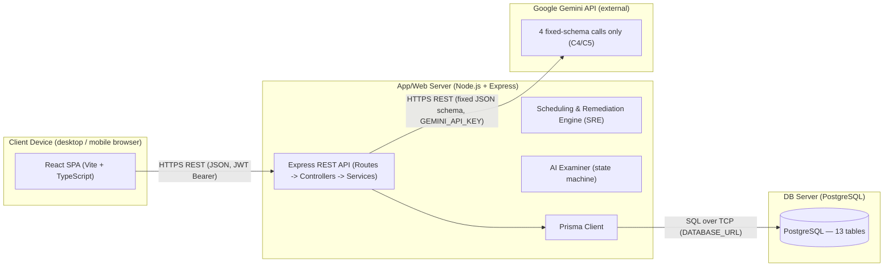

# Deployment View — Recall AI

> **SAD placement.** This is the content for **Section 5 — Deployment View** of the Software
> Architecture Document. It fulfils **issue #111** (PA4 mục a, deployment assignment
> @phong0801) and feeds the full SAD assembly (**#84 / I5.1**).
>
> **Source of truth.** This repository has **no Docker/IaC/hosting configuration** (no
> `Dockerfile`, `docker-compose.yml`, `Procfile`, or Vercel/Railway/Fly config), so the topology
> below is the **target deployment** inferred directly from the running application's own
> configuration surface, not copied from an existing deployment manifest:
> [`src/server/.env.example`](../../src/server/.env.example) (`PORT`, `DATABASE_URL`,
> `GEMINI_API_KEY`), [`src/client/.env.example`](../../src/client/.env.example)
> (`VITE_API_BASE_URL`), and the runtime dependencies declared in
> [`src/server/package.json`](../../src/server/package.json) (Express 5, `@prisma/client` +
> `pg`, `@google/genai`) and [`src/client/package.json`](../../src/client/package.json)
> (React 19 + Vite). Nothing beyond what these files state is invented (constraint **C5**
> applies to code-generation, but the same "stay grounded in evidence" discipline is followed
> here).
>
> **Submission image (the actual PA4 deliverable):**
> [`pa/pa4/Architecture Views/DV-01_DeploymentView.png`](../../pa/pa4/Architecture%20Views/DV-01_DeploymentView.png)
> — rendered from [`uml/deployment-view.puml`](uml/deployment-view.puml) via PlantUML
> (`java -jar plantuml.jar -tpng -Sdpi=200 uml/deployment-view.puml`), following the same
> convention as `pa/pa3/Architecture Views/AR-01_3Tier-Overview.png`. The Mermaid diagram below
> is the GitHub-readable working copy for the team, not the submission artifact.

## 5.1 Overview

Recall AI deploys as **four physical/logical nodes**: a client device running the browser SPA,
an application/web server running the Express API, a database server running PostgreSQL, and
the external Google Gemini API reached over the internet. This mirrors the 3-tier logical view
already documented in §4 ([`architecture-3tier.puml`](uml/architecture-3tier.puml)) — the
Deployment View maps those same components onto the machines that actually run them.

## 5.2 Deployment Diagram

## 5.3 Node Descriptions & Protocols

| Node                                                | Runs                                                                                                                                                                                                                                                                                                          | Inbound / Outbound protocol                                                                                                                                          |
| --------------------------------------------------- | ------------------------------------------------------------------------------------------------------------------------------------------------------------------------------------------------------------------------------------------------------------------------------------------------------------- | -------------------------------------------------------------------------------------------------------------------------------------------------------------------- |
| **Client Device** (desktop or mobile browser)       | The React SPA (Vite + TypeScript) — Presentation Tier from §4.2. Built assets are served to the browser and then talk directly to the App/Web Server via `VITE_API_BASE_URL`.                                                                                                                                 | **Out:** HTTPS REST, JSON payloads, JWT Bearer auth, to the App/Web Server.                                                                                          |
| **App/Web Server** (Node.js + Express)              | The Express REST API (Routes → Controllers → Services), the Scheduling & Remediation Engine, the AI Examiner state machine, and the Prisma Client — all Application Tier components from §4.2–4.7 co-located on one process/node. Configured via `PORT` (default `3001`), `JWT_SECRET`, `JWT_REFRESH_SECRET`. | **In:** HTTPS REST from the Client Device. **Out:** SQL over TCP to the DB Server (via Prisma, `DATABASE_URL`); HTTPS REST to the Gemini API (via `GEMINI_API_KEY`). |
| **DB Server** (PostgreSQL)                          | The persistence layer — 13 tables per §4.6 (`users`, `study_plans`, `concepts`, `concept_edges`, `analysis_jobs`, `question_cache`, `interview_sessions`, `interview_turns`, `focus_sessions`, `review_queue_items`, `documents`, `concept_sources`, `session_notes`).                                        | **In:** SQL over TCP from the App/Web Server only — never reached directly by the Client.                                                                            |
| **Google Gemini API** (external, managed by Google) | Google's hosted Gemini models. Called only through the 4 fixed-schema calls (`extract_concepts`, `generate_question`, `grade_answer`, `summarize_session`) per constraints C4/C5 — the App/Web Server is always the orchestrator, Gemini never decides control flow.                                          | **In:** HTTPS REST from the App/Web Server only.                                                                                                                     |

## 5.4 Notes

- The Client Device never talks to the DB Server or Gemini API directly — every request is
  mediated by the App/Web Server, keeping the AI-orchestration boundary (constraint **C4**) and
  auth checks in one place.
- No CDN, load balancer, or container orchestration exists in the current codebase; this
  diagram documents the minimal 3-node + 1-external-service topology the application requires
  to run, not a specific cloud provider's managed services.
