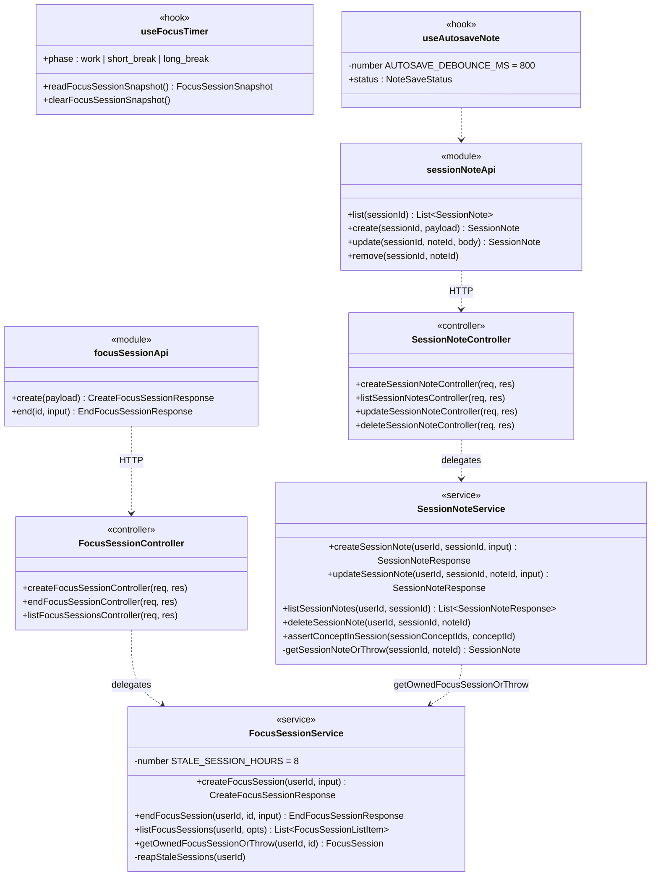

# Focus Session — Architecture (Component: Focus Session)

> **SAD placement.** Content for **Section 4.8** of the Software Architecture Document
> (_Logical View → Component: Focus Session_). Closes the PA3-feedback gap that only 3 of the 5
> use-case modules (AM, SP, and AE — but not FS or DB) had a dedicated §4 subsection; this PR
> adds both missing ones (FS here, DB in `dashboard-architecture.md`). Fulfils issue **#111**
> (PA4 mục a) and feeds the full SAD assembly (**#84 / I5.1**).
>
> **Source of truth:** the actual code under
> [`src/server/src/services/focus-session.service.ts`](../../src/server/src/services/focus-session.service.ts),
> [`session-note.service.ts`](../../src/server/src/services/session-note.service.ts), and the
> `src/client/src/features/focus/**` front-end feature. Nothing is invented.
>
> **Submission image:** [`uml/class-focus-session.puml`](uml/class-focus-session.puml), rendered
> via PlantUML (`java -jar plantuml.jar -tpng -Sdpi=200 uml/class-focus-session.puml`) →
> [`pa/pa4/Class Diagrams/CD-04_FocusSession.png`](../../pa/pa4/Class%20Diagrams/CD-04_FocusSession.png).
> The Mermaid diagram below is the GitHub-readable working copy, not the submission artifact.

## 4.8.1 Overview

Focus Session covers **FS-01** (Pomodoro study session), **FS-02** (Pomodoro configuration —
`PomodoroConfigPanel`, `pomodoroConfigApi`, `users.pomodoro_config` via
`GET/PATCH /me/pomodoro-config`), **FS-03** (session history), **FS-04** (source document view
during a session — `SessionDocument`, `DocumentExcerpt`, `DocumentFullText`,
`useSessionDocument`), and **FS-05** (quick notes during a session). Architecturally it is a
thin, self-contained CRUD-plus-timer component: the server persists session lifecycle and notes;
the Pomodoro clock itself is **entirely client-side** (no server ticking) so the study timer
keeps running through network blips.

Two backend services share one ownership gate: `SessionNoteService` calls
`FocusSessionService.getOwnedFocusSessionOrThrow()` before touching any note, so the "session
belongs to this user" check lives in exactly one place for both the session and its 4 nested
note endpoints (`/focus-sessions/:id/notes*`).

## 4.8.2 Class Diagram

| Class                    | Kind   | Key members                                                                                                                                                        | Responsibility                                                                                                                                           |
| ------------------------ | ------ | ------------------------------------------------------------------------------------------------------------------------------------------------------------------ | -------------------------------------------------------------------------------------------------------------------------------------------------------- |
| `FocusSessionController` | module | `createFocusSessionController`, `endFocusSessionController`, `listFocusSessionsController`                                                                         | Thin HTTP adapters over `FocusSessionService`                                                                                                            |
| `FocusSessionService`    | module | `createFocusSession`, `endFocusSession`, `listFocusSessions`, `getOwnedFocusSessionOrThrow` (exported, reused by notes), `reapStaleSessions` (private, lazy sweep) | Session lifecycle: create (with plan/concept ownership checks), end/cancel, history; **never writes `mastery_score`** — that stays the AI Examiner's job |
| `SessionNoteController`  | module | 4 controllers, one per note endpoint                                                                                                                               | HTTP adapters over `SessionNoteService`, all nested under `/focus-sessions/:id/notes`                                                                    |
| `SessionNoteService`     | module | `createSessionNote`, `updateSessionNote`, `listSessionNotes`, `deleteSessionNote`, `assertConceptInSession` (pure, R05)                                            | Note CRUD anchored to a concept **within** the session's own `conceptIds`; auto-save path is `updateSessionNote`                                         |
| `useFocusTimer`          | hook   | `phase` (work/short_break/long_break), `readFocusSessionSnapshot`/`clearFocusSessionSnapshot`                                                                      | Client-only Pomodoro engine; snapshots to `localStorage` every 10s so a closed tab can resume/recover                                                    |
| `useAutosaveNote`        | hook   | `AUTOSAVE_DEBOUNCE_MS = 800`, `status: NoteSaveStatus`                                                                                                             | Debounced auto-save (FS-05 AC: "~800ms after typing stops"); keeps a local draft so an offline/closed tab doesn't lose text                              |

## 4.8.3 Design Notes

- **Lazy stale-session reaping, no cron.** A `running` session with no `endedAt` older than
  `STALE_SESSION_HOURS` (8h) is treated as abandoned and closed (`status = 'cancelled'`) the next
  time `listFocusSessions` or `endFocusSession` runs for that user — not by a background job.
- **Client-owned timer.** `useFocusTimer` runs the Pomodoro clock entirely in the browser;
  the server only ever sees a `create` at session start and one `end` (PATCH) at session end with
  the client-measured `focusedSeconds`/`awayCount`/`pomodorosCompleted`. This keeps the timer
  ticking through brief network loss and avoids a server-side scheduler for something purely
  presentational.
- **`mastery_score` boundary (shared with §4.7 AI Examiner).** Focus Session writes study
  statistics only (`duration_minutes`, `focused_seconds`, …); it never touches
  `concepts.mastery_score` or `last_tested_at` — those fields are written **only** by the AI
  Examiner grading flow.
- **One ownership gate for 5 endpoints.** `getOwnedFocusSessionOrThrow` is exported specifically
  so `session-note.service.ts` reuses it rather than re-implementing the "not found vs not yours"
  check (both collapse to a `404`, never a `403`, to avoid leaking session existence).
- **Single-tab liveness via Web Locks (#319).** `sessionLock.ts` acquires a Web Locks API lock
  scoped to the active session id when `RunningSession` mounts, so a session accidentally opened
  in a second tab is detected client-side instead of silently double-counting `focusedSeconds`;
  this is a client-only liveness guard and does not change the server's single `create`/`end`
  contract described above.

## 4.8.4 Traceability

| Element                            | Requirement                 | Code                                                           |
| ---------------------------------- | --------------------------- | -------------------------------------------------------------- |
| Pomodoro session start/end         | FS-01                       | `focus-session.service.ts`                                     |
| Pomodoro configuration             | FS-02                       | `PomodoroConfigPanel.tsx`, `GET/PATCH /me/pomodoro-config`     |
| Session history                    | FS-03                       | `listFocusSessions`                                            |
| Source document during session     | FS-04, #227                 | `SessionDocument.tsx`, `useSessionDocument.ts`                 |
| Quick notes, auto-save             | FS-05, #228                 | `session-note.service.ts`, `useAutosaveNote.ts`                |
| Single-tab liveness guard          | #319                        | `sessionLock.ts`                                               |
| `session_notes` table              | #111 ER redraw              | `schema.prisma` `SessionNote`                                  |
| `mastery_score` never written here | AI-Examiner boundary (#128) | `focus-session.service.ts` (absence of the field in any write) |
