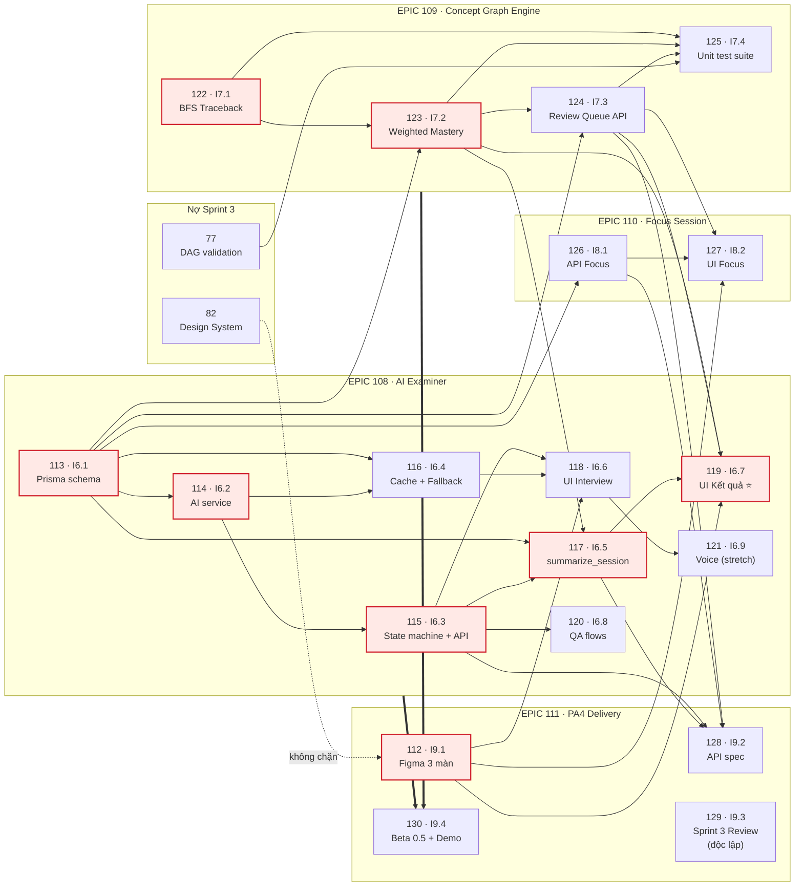

# Sprint 4 – Kế hoạch & Phân công

> **Giai đoạn:** Phase 3 – Construction, Iteration 1
> **Thời gian:** 27/07/2026 – 09/08/2026 (2 tuần)
> **Deliverable:** PA4 – Working Software v2 · **Release 0.5 (Beta)**
> **Milestone GitHub:** [Sprint 4](https://github.com/Lade1q/planning-ai/milestone/3) – hạn 09/08/2026
> **Nguồn:** `Software Development Plan v1.2.pdf` mục 2 (Deliverables), 4.2.1 (Phase & Iteration Plan), 4.2.3 (Milestones)

---

## 1. Mục tiêu Sprint

Trích nguyên văn mục tiêu Sprint 4 trong SDP v1.2:

> _"Implement the AI Examiner (multi-turn interview). Connect the grading results to the Concept Graph Engine built in Sprint 3. Test conversation flows. Deliver PA4."_

Ba vế đó ánh xạ thẳng sang 3 EPIC:

| Vế trong SDP                                        | EPIC                                                                               |
| --------------------------------------------------- | ---------------------------------------------------------------------------------- |
| Implement the AI Examiner (multi-turn interview)    | [#108 – AI Examiner](https://github.com/Lade1q/planning-ai/issues/108)             |
| Connect grading results to the Concept Graph Engine | [#109 – Traceback & Remediation](https://github.com/Lade1q/planning-ai/issues/109) |
| Test conversation flows                             | [#120 – I6.8](https://github.com/Lade1q/planning-ai/issues/120) (trong EPIC #108)  |
| Deliver PA4                                         | [#111 – PA4 Delivery](https://github.com/Lade1q/planning-ai/issues/111)            |

Cộng thêm [#110 – Focus Session](https://github.com/Lade1q/planning-ai/issues/110): trả nợ một hạng mục thuộc deliverable PA3 nhưng Sprint 3 không tạo issue nên bị bỏ sót.

**Tiêu chí đạt milestone (SDP mục 4.2.3):** _"AI Examiner + trace-back connected to real grading data, demo-ready"_.

---

## 2. Danh sách EPIC và issue

### EPIC #108 – AI Examiner: Phiên vấn đáp nhiều lượt

| Issue                                                    | Nội dung                                                      | Owner        | Ưu tiên               |
| -------------------------------------------------------- | ------------------------------------------------------------- | ------------ | --------------------- |
| [#113](https://github.com/Lade1q/planning-ai/issues/113) | I6.1 [BE] Prisma Schema Sprint 4 (1 migration duy nhất)       | Quân         | 🔴 High – **blocker** |
| [#114](https://github.com/Lade1q/planning-ai/issues/114) | I6.2 [BE] AI Service: `generate_question` + `grade_answer`    | Quân         | 🔴 High               |
| [#115](https://github.com/Lade1q/planning-ai/issues/115) | I6.3 [BE] Interview State Machine + REST API ⭐               | Quân + Phong | 🔴 High               |
| [#116](https://github.com/Lade1q/planning-ai/issues/116) | I6.4 [BE] Question Cache (AE-06) + Fallback Flashcard (AE-05) | Phong        | 🔴 High               |
| [#117](https://github.com/Lade1q/planning-ai/issues/117) | I6.5 [BE] Kết quả cuối phiên: `summarize_session`             | Phong        | 🟡 Medium             |
| [#118](https://github.com/Lade1q/planning-ai/issues/118) | I6.6 [FE] UI Phiên Interview                                  | Bảo          | 🔴 High               |
| [#119](https://github.com/Lade1q/planning-ai/issues/119) | I6.7 [FE] UI Kết quả cuối phiên + Traceback Panel ⭐          | Bảo          | 🔴 High               |
| [#120](https://github.com/Lade1q/planning-ai/issues/120) | I6.8 [QA] Test Cases + Test Conversation Flows                | Phát         | 🔴 High               |
| [#121](https://github.com/Lade1q/planning-ai/issues/121) | I6.9 [FE] Tầng giọng nói TTS/STT                              | Bảo          | 🟢 Low – _stretch_    |

### EPIC #109 – Concept Graph Engine: Traceback & Remediation ⭐

| Issue                                                    | Nội dung                                           | Owner | Ưu tiên   |
| -------------------------------------------------------- | -------------------------------------------------- | ----- | --------- |
| [#122](https://github.com/Lade1q/planning-ai/issues/122) | I7.1 [BE] Thuật toán BFS Traceback + Unit Tests ⭐ | Quân  | 🔴 High   |
| [#123](https://github.com/Lade1q/planning-ai/issues/123) | I7.2 [BE] Weighted Mastery + tích hợp Traceback ⭐ | Quân  | 🔴 High   |
| [#124](https://github.com/Lade1q/planning-ai/issues/124) | I7.3 [BE] Review Queue API – "Cần ôn hôm nay"      | Phong | 🟡 Medium |
| [#125](https://github.com/Lade1q/planning-ai/issues/125) | I7.4 [QA] Unit Test Suite cho Concept Graph Engine | Phát  | 🟡 Medium |

### EPIC #110 – Focus Session (nợ từ PA3)

| Issue                                                    | Nội dung                                      | Owner              | Ưu tiên   |
| -------------------------------------------------------- | --------------------------------------------- | ------------------ | --------- |
| [#126](https://github.com/Lade1q/planning-ai/issues/126) | I8.1 [BE] API Focus Session + Pomodoro Config | Phong              | 🟡 Medium |
| [#127](https://github.com/Lade1q/planning-ai/issues/127) | I8.2 [FE] UI Focus Session                    | Bảo (backup: Phát) | 🟡 Medium |

### EPIC #111 – PA4 Delivery: Design, Docs & Beta Release

| Issue                                                    | Nội dung                                    | Owner        | Ưu tiên                  |
| -------------------------------------------------------- | ------------------------------------------- | ------------ | ------------------------ |
| [#112](https://github.com/Lade1q/planning-ai/issues/112) | I9.1 [UI] Figma 3 màn hình mới              | Kiệt         | 🔴 High – **đường găng** |
| [#128](https://github.com/Lade1q/planning-ai/issues/128) | I9.2 [DOC] API Spec + sửa tài liệu bị lệch  | Quân + Phát  | 🔴 High                  |
| [#129](https://github.com/Lade1q/planning-ai/issues/129) | I9.3 [DOC] Sprint 3 Review + Weekly Reports | Kiệt         | 🔴 High                  |
| [#130](https://github.com/Lade1q/planning-ai/issues/130) | I9.4 [INFRA] Beta Release 0.5 + Demo PA4    | Phong + Kiệt | 🔴 High                  |

---

## 3. Đường găng (Critical Path) và bản đồ phụ thuộc

> **Nguồn sự thật là GitHub, không phải tài liệu này.** Toàn bộ quan hệ dưới đây đã được khai báo bằng **GitHub issue dependencies** – mở bất kỳ issue nào sẽ thấy khối _Blocked by / Blocking_ ở sidebar phải, và GitHub sẽ cảnh báo khi ai đó định đóng issue mà phần chặn chưa xong. Khi thay đổi quan hệ, sửa trên GitHub trước rồi mới cập nhật sơ đồ này.

**Đường găng (tô đỏ):** #113 → #114 → #115 → #117 → #119, cộng nhánh song song #122 → #123 → #119 và #112 → #119.

**Ma trận phụ thuộc** – bản chữ của sơ đồ trên, dùng khi in báo cáo:

| Issue                     | Bị chặn bởi            | Đang chặn                                | Bắt đầu được ngay?      |
| ------------------------- | ---------------------- | ---------------------------------------- | ----------------------- |
| #112 I9.1 Figma           | –                      | #118, #119, #127                         | ✅ ngày 1               |
| #113 I6.1 Schema          | –                      | #114, #115, #116, #117, #123, #124, #126 | ✅ ngày 1               |
| #114 I6.2 AI service      | #113                   | #115, #116                               | sau #113                |
| #115 I6.3 State machine   | #113, #114             | #117, #118, #120, #128                   | sau #114                |
| #116 I6.4 Fallback        | #113, #114             | #118                                     | sau #114                |
| #117 I6.5 Summary         | #113, #115, #123       | #119, #128                               | tuần 2                  |
| #118 I6.6 UI Interview    | #112, #115, #116       | #121                                     | ✅ mock data trước      |
| #119 I6.7 UI Kết quả ⭐   | #112, #117, #123, #124 | –                                        | ✅ mock data trước      |
| #120 I6.8 QA flows        | #115                   | –                                        | ✅ viết test case trước |
| #121 I6.9 Voice           | #118                   | –                                        | cuối sprint             |
| #122 I7.1 BFS Traceback   | –                      | #123, #125                               | ✅ ngày 1               |
| #123 I7.2 Mastery         | #113, #122             | #117, #119, #124, #125                   | sau #122                |
| #124 I7.3 Review Queue    | #113, #123             | #119, #125, #127, #128                   | sau #123                |
| #125 I7.4 Unit tests      | #77, #122, #123, #124  | –                                        | ✅ phần DAG trước       |
| #126 I8.1 API Focus       | #113                   | #127, #128                               | sau #113                |
| #127 I8.2 UI Focus        | #112, #124, #126       | –                                        | tuần 2                  |
| #128 I9.2 API spec        | #115, #117, #124, #126 | –                                        | ✅ viết dần             |
| #129 I9.3 Sprint 3 Review | –                      | –                                        | ✅ ngày 1               |
| #130 I9.4 Beta + Demo     | EPIC #108, #109        | –                                        | cuối sprint             |

> ⚠️ **Một quan hệ đã được sửa khi khai báo:** bản kế hoạch đầu tiên ghi #122 (BFS Traceback) chờ #113 (Prisma schema). Sai – #122 là hàm thuần, tự khai báo interface riêng nên **chạy song song từ ngày 1**. Giữ nguyên như vậy sẽ kéo dài đường găng thêm 1–2 ngày một cách vô nghĩa.

**Hai nút thắt cần canh chừng:**

1. **#113 (Prisma Schema)** chặn gần như toàn bộ Backend. Phải xong **trong 1–2 ngày đầu sprint**. Gộp thành một migration duy nhất để tránh 4 migration song song trên 4 branch làm hỏng DB của cả team.
2. **#112 (Figma)** chặn cả 3 task Frontend. Phải xong **trước 31/07** (cuối tuần 1). Nếu trễ, Bảo dựng UI bằng design system hiện có và chấp nhận sửa lại.

**Đích của demo PA4 là #119** – màn kết quả có khối Traceback. Mọi thứ khác là đường dẫn tới đó.

---

## 4. Phân bổ theo người

| Thành viên               | Vai trò (RACI trong SDP)                               | Issue Sprint 4                     | Carry-over Sprint 3         |
| ------------------------ | ------------------------------------------------------ | ---------------------------------- | --------------------------- |
| **Quân** (@Lade1q)       | Architect – Concept Graph Engine R/A, AI integration R | #113, #114, #115, #122, #123, #128 | #77                         |
| **Phong** (@phong0801)   | Backend Leader – Backend API R/A                       | #115, #116, #117, #124, #126, #130 | #101                        |
| **Bảo** (@baonguyen1776) | Frontend Leader – Frontend R/A                         | #118, #119, #127, #121             | #78, #79                    |
| **Phát** (@NMP039)       | QA – Testing R/A                                       | #120, #125, #127 (backup), #128    | #74, #80                    |
| **Kiệt** (@tkiet24)      | PM & UI/UX – Sprint planning R/A, UI design R/A        | #112, #129, #130                   | #82, #83, #84–#87, #90, #91 |

**Cảnh báo tải:** Bảo có 3 issue Sprint 4 + 2 carry-over Frontend. Đây là điểm rủi ro lớn nhất của sprint (Sprint 3 cho thấy Backend chạy nhanh hơn Frontend rõ rệt). Phương án: Phát là backup owner cho #127 theo mitigation của risk **R07** trong SDP (_"mỗi thành phần có 1 owner chính và 1 owner dự phòng"_), và #121 (voice) sẵn sàng cắt.

---

## 5. Thứ tự cắt giảm nếu sprint quá tải

Cắt từ dưới lên, **không** cắt tuỳ hứng:

1. **#121** I6.9 Voice layer – stretch goal, cắt đầu tiên, không ảnh hưởng ai
2. **#127** I8.2 UI Focus Session
3. **#126** I8.1 API Focus Session – cắt cả EPIC #110 nếu cần
4. **#117** I6.5 Summary – có thể tạm hiển thị bảng điểm không kèm nhận xét AI

**Tuyệt đối không cắt:** #113, #115, #122, #123, #119. Đây là bộ xương của PA4 – thiếu một cái là không demo được điểm khác biệt của sản phẩm.

---

## 6. Ràng buộc kiến trúc – áp dụng cho mọi issue

| #                  | Ràng buộc                                                                                                                                                                                  | Nguồn                                            |
| ------------------ | ------------------------------------------------------------------------------------------------------------------------------------------------------------------------------------------ | ------------------------------------------------ |
| **C4**             | AI không bao giờ là orchestrator. Mọi điều phối là code tất định. AI chỉ được gọi với 4 schema JSON cố định: `extract_concepts`, `generate_question`, `grade_answer`, `summarize_session`. | SDP mục 4.2 (Constraints), `UC-Overview.md` §5.1 |
| **C5**             | AI không được bịa nội dung ngoài tài liệu người dùng đã upload.                                                                                                                            | SDP                                              |
| **C6**             | Tối đa 3 lượt hỏi–đáp mỗi khái niệm.                                                                                                                                                       | SDP, risk R08                                    |
| **DAG**            | Đồ thị khái niệm bắt buộc là DAG, validate bằng Kahn's Algorithm ở mọi thao tác lưu.                                                                                                       | `UC-Overview.md` §5.2, risk R03/R09              |
| **max_depth = 2**  | Traceback tối đa 2 tầng.                                                                                                                                                                   | `Use-case_Specification.pdf` mục 2.5             |
| **Ngưỡng 0.6**     | `mastery_score < 0.6` → kích hoạt traceback. Hằng số, đặt một chỗ duy nhất.                                                                                                                | `UC-Overview.md` §5.3                            |
| **`null` ≠ `0.0`** | `null` = chưa kiểm tra; `0.0` = đã kiểm tra và sai. Không được gộp.                                                                                                                        | `UC-Overview.md` §5.3                            |

---

## 7. Điểm lệch tài liệu phát hiện khi lập kế hoạch

Bốn điểm dưới đây được phát hiện khi đối chiếu `Use-case_Specification.pdf v1.0` (bản đã nộp PA2) với các file markdown trong `docs/requirements/`. Đã ghi vào [#128](https://github.com/Lade1q/planning-ai/issues/128) để sửa, và cần đồng bộ sang [#87](https://github.com/Lade1q/planning-ai/issues/87) (UC Spec v2.0).

| #   | Điểm lệch                                                                                                                                                                                                  | Hướng xử lý ở Sprint 4                                                                                                                                     |
| --- | ---------------------------------------------------------------------------------------------------------------------------------------------------------------------------------------------------------- | ---------------------------------------------------------------------------------------------------------------------------------------------------------- |
| 1   | **Giọng nói.** PDF mục 2.3 đặt TTS/STT vào **basic flow** (bước 3, 4, 5, 6, 12 + pre-condition quyền micro). Nhưng `UC-Overview.md` §5.6 lại ghi Voice Input _"không có UC chính thức"_ → câu này **sai**. | Chốt: Sprint 4 làm **luồng text trước**, tầng voice tách ra [#121](https://github.com/Lade1q/planning-ai/issues/121) (stretch). Sửa §5.6 cho đúng sự thật. |
| 2   | **Pseudocode traceback sai depth-tracking.** `UC-04_AIExaminer.md` (UC-13) viết `depth += 1` bên trong vòng `while` → thuật toán dừng sau đúng 3 node.                                                     | Implement theo bản đúng ở `UC-Overview.md` §5.3 (queue chứa tuple `(id, depth)`). Sửa hoặc xoá pseudocode sai trong UC-04.                                 |
| 3   | **Thiếu quy tắc pruning.** PDF mục 2.5 AF1 ghi rõ: gặp prereq đã vững thì _"will not traverse deeper into the prerequisites of this P"_. Bản markdown không có quy tắc này.                                | Đã đưa vào acceptance criteria + unit test của [#122](https://github.com/Lade1q/planning-ai/issues/122). Bổ sung vào UC-04.                                |
| 4   | **Focus Session ↔ mastery mơ hồ.** PDF mục 2.2 bước 11 viết SRE _"updates mastery parameters"_, dễ hiểu nhầm là Focus Session sửa `mastery_score`; nhưng post-condition làm rõ là _"(study statistics)"_.  | Chốt: **chỉ AI Examiner mới ghi `mastery_score`**. Focus Session chỉ ghi thống kê thời gian học. Làm rõ câu chữ trong UC Spec v2.0.                        |

---

## 8. Rủi ro cần theo dõi trong sprint

| Risk    | Mô tả                                                       | Exposure          | Xử lý ở Sprint 4                                                                                                                                                                |
| ------- | ----------------------------------------------------------- | ----------------- | ------------------------------------------------------------------------------------------------------------------------------------------------------------------------------- |
| **R01** | Hết quota Gemini giữa demo                                  | **15 – cao nhất** | [#116](https://github.com/Lade1q/planning-ai/issues/116) fallback Flashcard + [#130](https://github.com/Lade1q/planning-ai/issues/130) chuẩn bị 2 API key + video demo dự phòng |
| **R02** | AI trả về quan hệ tiên quyết sai → traceback kém chất lượng | 16                | Human-in-the-loop: user sửa đồ thị (#79) và xác nhận/bỏ qua đề xuất traceback ([#119](https://github.com/Lade1q/planning-ai/issues/119))                                        |
| **R05** | Concept Graph Engine không kịp                              | 10                | Thuật toán tách khỏi DB/AI, unit test độc lập ([#122](https://github.com/Lade1q/planning-ai/issues/122), [#125](https://github.com/Lade1q/planning-ai/issues/125))              |
| **R07** | Thành viên vắng giữa sprint                                 | 8                 | Mỗi thành phần có owner dự phòng – xem cột "backup" mục 4                                                                                                                       |
| **R09** | Lệch interface Frontend ↔ Backend                           | 6                 | [#128](https://github.com/Lade1q/planning-ai/issues/128) viết API spec **song song** với code, không viết sau                                                                   |
| **R10** | Model Gemini bị khai tử                                     | 5                 | Model ID luôn nằm trong biến môi trường, Gemini bọc sau lớp abstraction                                                                                                         |

---

## 9. Lịch trong sprint

| Mốc                  | Ngày           | Nội dung                                                                                             |
| -------------------- | -------------- | ---------------------------------------------------------------------------------------------------- |
| Sprint Planning      | 27/07 (CN)     | Chốt phân công, mọi người nhận issue                                                                 |
| **#113 phải xong**   | 28–29/07       | Schema DB merge vào `main`, cả team pull + migrate                                                   |
| **#112 phải xong**   | 31/07 (T5)     | Figma bàn giao cho Frontend                                                                          |
| Weekly report tuần 1 | 02/08 (T7)     | `docs/management/weekly-reports/week-7.md`                                                           |
| Mốc giữa sprint      | 03/08 (CN)     | Rà soát: EPIC #108 + #109 phải chạy được end-to-end ở local. Chưa được → kích hoạt mục 5 (cắt giảm). |
| Deploy nháp          | 05/08 (T3)     | [#130](https://github.com/Lade1q/planning-ai/issues/130) – deploy sớm để còn thời gian sửa           |
| Chạy thử demo        | 07–08/08       | Chạy trọn kịch bản demo tối thiểu 2 lần                                                              |
| **PA4 Submission**   | **09/08 (T7)** | Milestone Beta Release 0.5                                                                           |
| Sprint Retrospective | 09/08          | `docs/management/sprint-reviews/sprint-4-retrospective.md`                                           |

---

## 10. Definition of Done cho cả Sprint

- [ ] Chạy được **end-to-end trên Gemini thật**: đăng nhập → chọn plan → phiên Interview → trả lời sai một khái niệm có tiên quyết → màn kết quả hiện đúng khối Traceback chỉ ra khái niệm gốc rễ.
- [ ] `npm test` pass: unit test cho DAG, Traceback, Mastery, Priority – chạy được **không cần DB, không cần API key**.
- [ ] Ngắt Gemini giữa phiên → hệ thống chuyển Flashcard fallback, không sập.
- [ ] Mọi endpoint mới có spec trong `docs/api/`.
- [ ] 6 kịch bản hội thoại (CF-01 → CF-06) đã chạy, **CF-03 và CF-05 phải Đạt**.
- [ ] Kịch bản demo đã chạy thử 2 lần, dưới 7 phút.
